# TDI Project - 3D Reconstruction of Objects From pictures Using Structure from Motion (SFM)
Yu Zhao  
yuzha0215@gmail.com

## Background
I am a PhD candidate at the University of Illinois at Urbana-Champaign. My research was about indoor air quality in human or animal buildings. 
I am familar with data science, computer vision and programming. I have utilized data science to solve my [research problem](https://yuzhao0215.github.io/ds_portfolio/projects/project1.html).
And here is a link to a little [Heroku application](https://yuzhao0215.github.io/ds_portfolio/projects/project2.html) I made. 
I am interested in data science not only because it is helpful for research, but also because it can solve real world problems.

## Motivation and Objective
Why I wanted to do a project about 3D reconstruction from pictures? Although we are usually dealing with 2D pictures on Internet, 3D object can sometimes make our lifes easier. For example, there is a function on Amazon's app called "view in your room". Before you buy a television, or a big furniture, you can test if it fits your room by virtually placing the 3D model in your room. 

	

Another example that 3D reconstruction can help in business is in construction industry. Before construction, it is important to know the 3D shape of the construction site. A drone can be used to capture images of a building from different views, then reconstruct the 3D shape of the building. So that they one can do data analysis on the 3D shape such as distance or area measurements.

	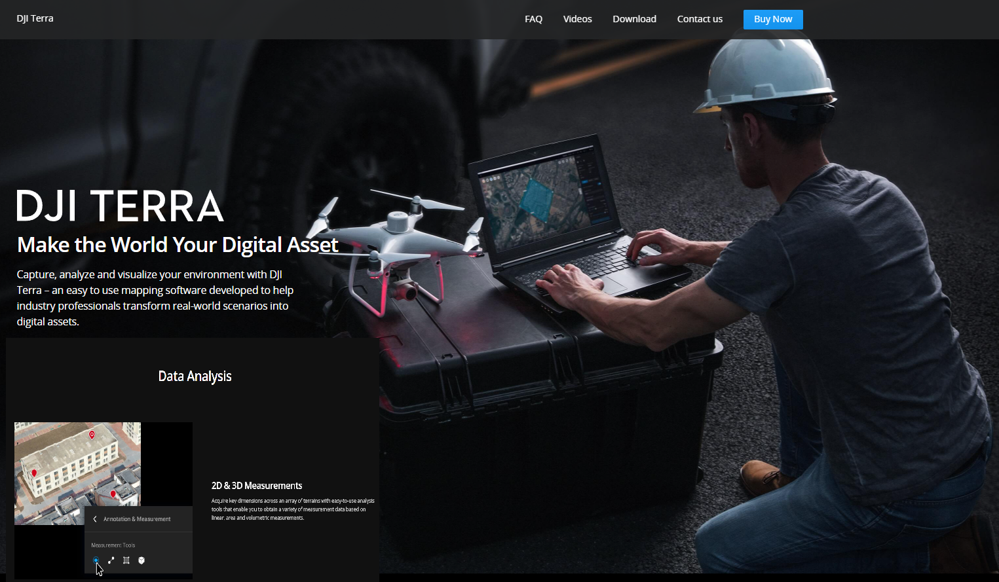

Therefore, the goal of this project is to train a model using existing pictures either taken by yourself or collected from internet. To achieve this, Feature Detection, Structure From Motion (SFM), Bundle Adjustment, and Neural Volume Rendering are needed.

	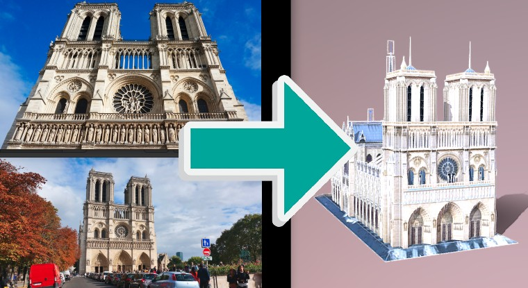

Different from current existing 3D reconstruction tools, this project will also implement the Neural Volume Rendering. Instread of reconstructing a object's 3D mesh or point cloud, it represts 3D model implicitly using differentiable deep learning models. This reduces the size of 3D models, however can provide great details of a object. For example, the [NeRF](https://www.matthewtancik.com/nerf) can generate high-detailed novel view of object using a 5MB model. The following figure is from the NeRF paper to show the idea of neural rendering.

	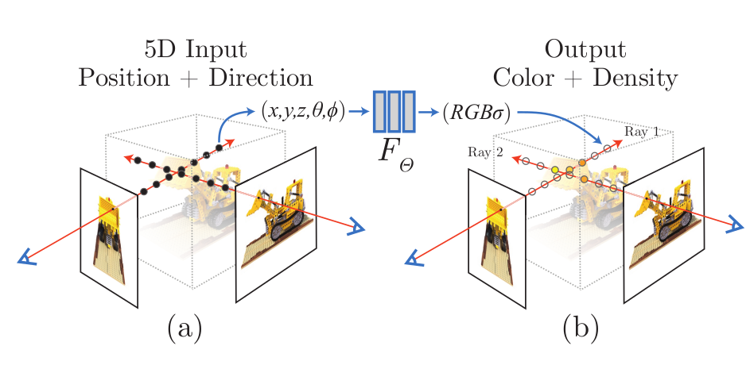

## Data
I collected several datasets for this project. The first dataset is from the project [Photo Tourism](http://phototour.cs.washington.edu/). It contains eight gigabytes images of some famous architectures collected from Internet. They are pictures Some self taken pictures are also used for preliminary results as shown below. The left two sample images are from online dataset, and the right two images were taken by myself of a scaled building model.  

	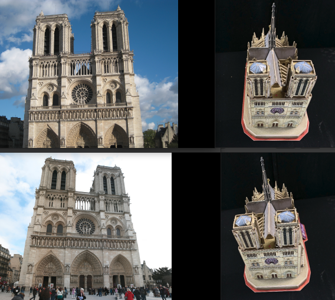

Another dataset I will use is called [BlendedMVS](https://github.com/YoYo000/BlendedMVS). This dataset is good for testing Neural Volume Rendering because all camera parameters are provided.

	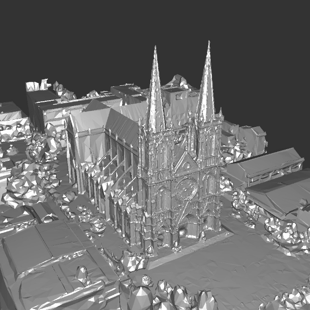

## What have been done
1. First, a data processing pipeline was built consisting of Feature Detection, Structure From Motion, and Bundle Adjustment. These three tasks used method provided [here](https://github.com/nghiaho12/SFM_example/blob/master/src/main.cpp). This pipeline finds the optimal camera parameters including angles of views and camera positions as shown in following figure. It can also generate sparse pointclouds for reference. This pipeline is necessary because for most self taken and online pictures, these parameters are unknown and thus need to be initialized and optimized. To test if this pipeline is correctly built, a set of self taken images of a building model is passed to it and the output camera parameters are used to construct point clouds. The results show that the camera parameters can be correctly calculated. 

	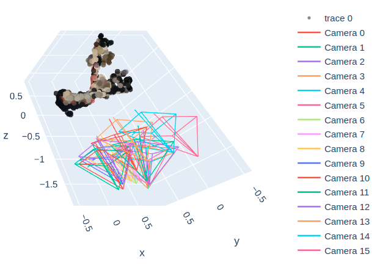

2. A basic volume rendering was trained to show the feasibily of generating novel views of existing 2D images. In this task, the images with optimized cameras parameters from the data processing pipeline were used as training data. A classic volume render is trained using pytorch3D. The results show that the 3D projection from 3D volume (a group of voxels) to target images can be learned quickly with a Huber Loss less than 0.01 in 400 hundred iterations.  

  
  
Initial  
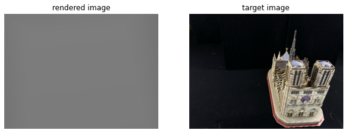  
Iterations 50  
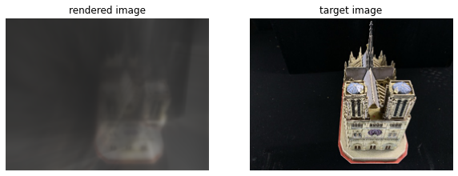  
Iteration 100  
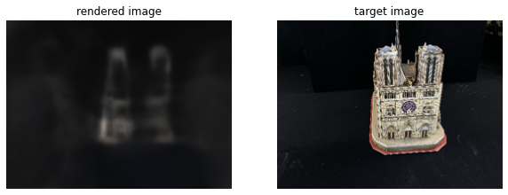  
Iteration 150  
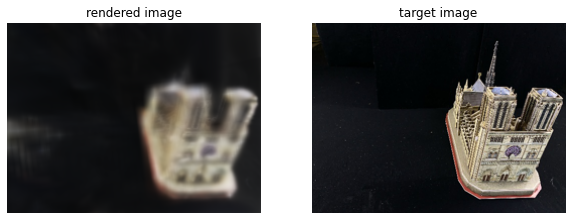  
Iteration 200  
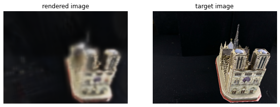  
Iteration 250  
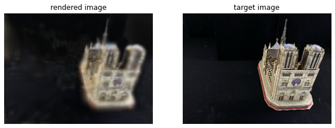  
Iteration 300  
  
Iteration 350  
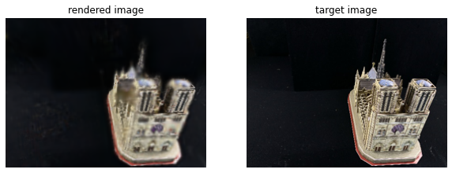  

## What to do next
1. Improve the data processing pipeline to handle larger online dataset. Data cleaning need to be performed because some images do not have camera parameters recorded (focal length, original image size), which makes the rendering more challenge.
2. Train a better model such as NeRF or [Plenoxels](https://alexyu.net/plenoxels/?s=09), which can generate more detailed images.  

